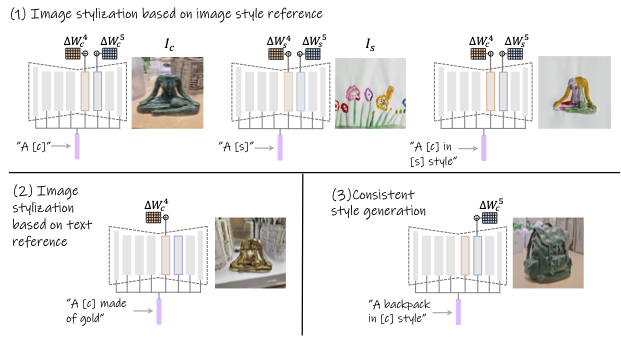

# Implicit Style-Content Separation using B-LoRA

[Paper on arXiv](https://arxiv.org/abs/2403.14572)

Project Page: [https://B-LoRA.github.io](https://B-LoRA.github.io/B-LoRA/)


This repository contains the official implementation of the B-LoRA method, which enables implicit style-content separation of a single input image for various image stylization tasks. B-LoRA leverages the power of Stable Diffusion XL (SDXL) and Low-Rank Adaptation (LoRA) to disentangle the style and content components of an image, facilitating applications such as image style transfer, text-based image stylization, and consistent style generation.

## Getting Started

### Prerequisites
- Python 3.11.6+
- PyTorch 2.1.1+
- Other dependencies (specified in `requirements.txt`)

### Installation

1. Clone this repository:
   ```
   git clone git@github.com:yardenfren1996/B-LoRA.git
   cd B-LoRA
   ```

2. Install the required dependencies:
   ```
   pip install -r requirements.txt
   ```

### Usage

1. **Training B-LoRAs**

   To train the B-LoRAs for a given input image, run:
   ```
   accelerate launch train_dreambooth_b-lora_sdxl.py \
    --pretrained_model_name_or_path="stabilityai/stable-diffusion-xl-base-1.0" \
    --instance_data_dir="<path/to/example_images>" \
    --output_dir="<path/to/output_dir>" \
    --instance_prompt="<prompt>" \
    --resolution=1024 \
    --rank=64 \
    --train_batch_size=1 \
    --learning_rate=5e-5 \
    --lr_scheduler="constant" \
    --lr_warmup_steps=0 \
    --max_train_steps=1000 \
    --checkpointing_steps=500 \
    --seed="0" \
    --gradient_checkpointing \
    --use_8bit_adam \
    --mixed_precision="fp16"
      ```
This will optimize the B-LoRA weights for the content and style and store them in  `output_dir`.
Parameters that need to replace  `instance_data_dir`, `output_dir`, `instance_prompt` (in our paper we use `A [v]`)



2. **Inference**

   For image stylization based on a reference style image (1), run:
   ```
   python inference.py --prompt="A <c> in <s> style" --content_B_LoRA="<path/to/content_B-LoRA>" --style_B_LoRA="<path/to/style_B-LoRA>" --output_path="<path/to/output_dir>"
   ```
   This will generate new images with the content of the first B-LoRA and the style of the second B-LoRA.
   Note that you need to replace `c` and `s` in the prompt according to the optimization prompt.

   For text-based image stylization (2), run:
   ```
   python inference.py --prompt="A <c> made of gold"" --content_B_LoRA="<path/to/content_B-LoRA>" --output_path="<path/to/output_dir>"
   ```
   This will generate new images with the content of the given B-LoRA and the style specified by the text prompt.

   For consistent style generation (3), run:
   ```
   python inference.py --prompt="A backpack in <s> style" --style_B_LoRA="<path/to/style_B-LoRA>" --output_path="<path/to/output_dir>"
   ```
   This will generate new images with the specified content and the style of the given B-LoRA.


   Several additional parameters that you can set in the `inference.py` file include:
   1. `--content_alpha`, `--style_alpha` for controlling the strength of the adapters.
   2. `--num_images_per_prompt` for specifying the number of output images.

## Citation

If you use B-LoRA in your research, please cite the following paper:

```bibtex
@misc{frenkel2024implicit,
      title={Implicit Style-Content Separation using B-LoRA}, 
      author={Yarden Frenkel and Yael Vinker and Ariel Shamir and Daniel Cohen-Or},
      year={2024},
      eprint={2403.14572},
      archivePrefix={arXiv},
      primaryClass={cs.CV}
}
```

## License

This project is licensed under the [MIT License](LICENSE).

## Contact

If you have any questions or suggestions, please feel free to open an issue or contact the authors at [yardenfren@gmail.com](mailto:yardenfren@gmail.com).
