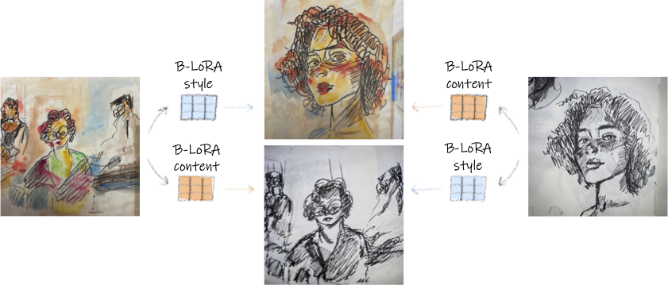

# Implicit Style-Content Separation using B-LoRA

[Paper on arXiv](https://arxiv.org/abs/2403.14572)

Project Page: [https://B-LoRA.github.io](https://B-LoRA.github.io/B-LoRA/)



This repository contains the official implementation of the B-LoRA method, which enables implicit style-content separation of a single input image for various image stylization tasks. B-LoRA leverages the power of Stable Diffusion XL (SDXL) and Low-Rank Adaptation (LoRA) to disentangle the style and content components of an image, facilitating applications such as image style transfer, text-based image stylization, and consistent style generation.

## Code will be available soon...

## Citation

If you use B-LoRA in your research, please cite the following paper:

```bibtex
@misc{frenkel2024implicit,
      title={Implicit Style-Content Separation using B-LoRA}, 
      author={Yarden Frenkel and Yael Vinker and Ariel Shamir and Daniel Cohen-Or},
      year={2024},
      eprint={2403.14572},
      archivePrefix={arXiv},
      primaryClass={cs.CV}
}
```

## License

This project is licensed under the [MIT License](LICENSE).

## Contact

If you have any questions or suggestions, please feel free to open an issue or contact the authors at [yardenfren@gmail.com](mailto:yardenfren@gmail.com).
